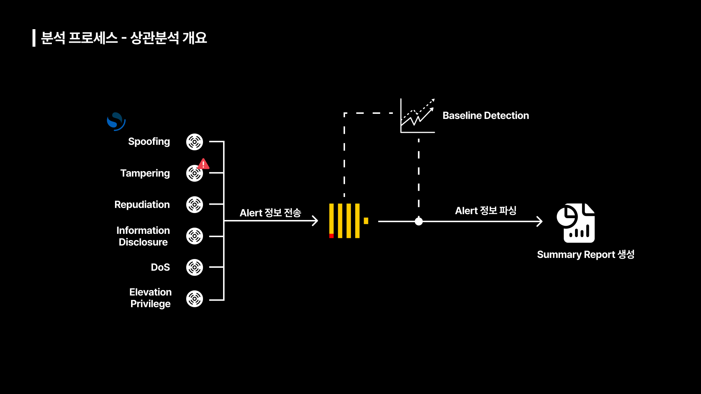
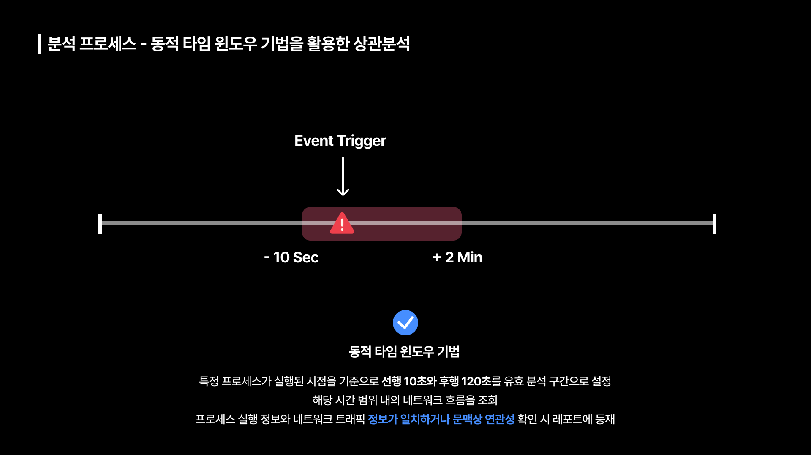
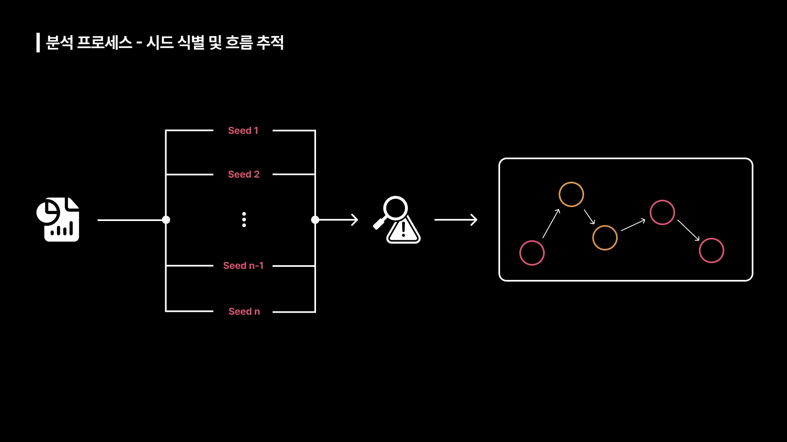
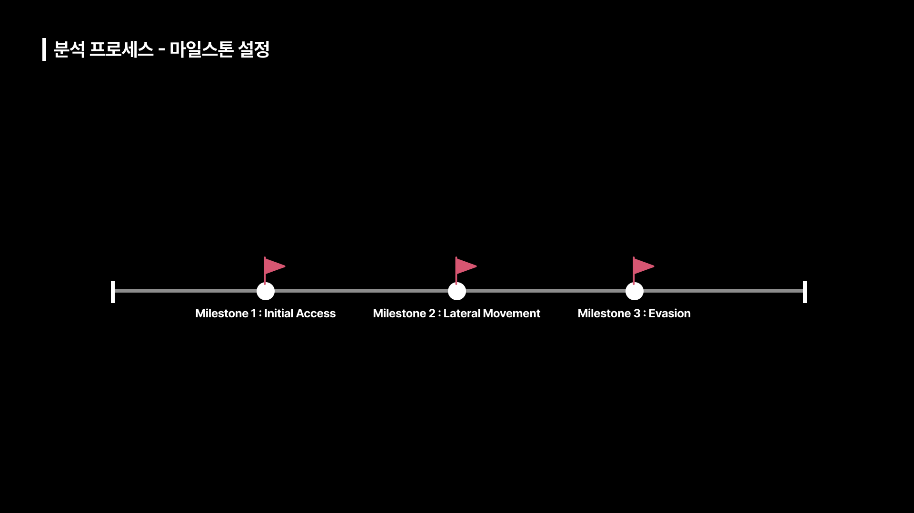
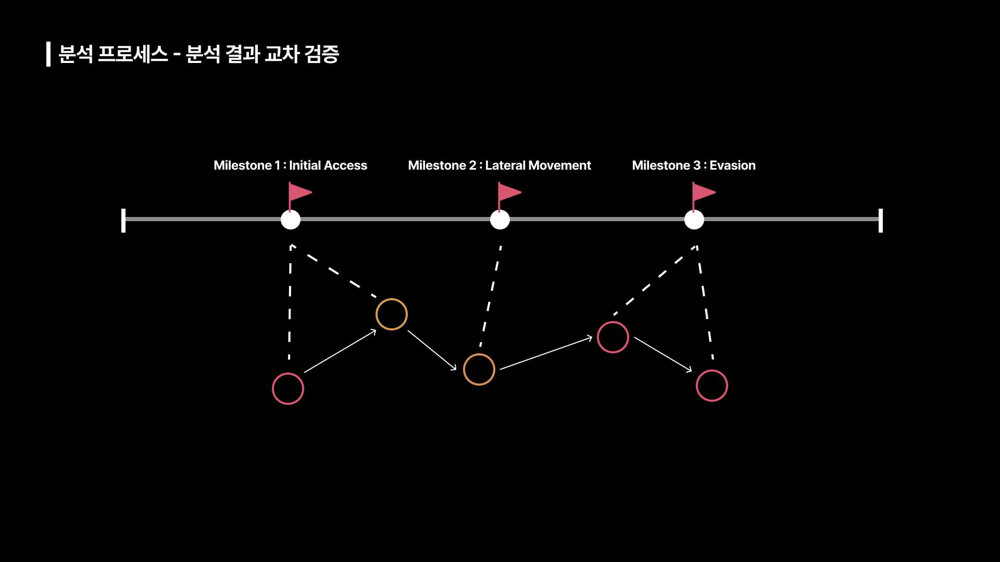

# 분석 프로세스

 

앞선 탐지 레벨에서 Alert가 발생하면 OpenSearch에서 Web Hook을 이용해 ClickHouse로 Alert 정보를 전송합니다. 이후 ClickHouse에서 수행한 Anomaly Detection 결과와 Alert 정보를 파싱하여 상관분석을 위한 Summary Report를 생성합니다.  
해당 레포트의 소스는 `TimeStamp`, `Pod Name`, `실행 Binary`, `Argument` 입니다. 특히, `Argument`에는 `IP`, `Domain`, `Port Number`와 같은 정보를 포함합니다.  
이렇게 추출한 정보들은 시스템 로그에서 네트워크 로그와 대조하기 위한 핵심 키 값으로 활용되고, 동일한 파드에서 동일한 명령어가 반복적으로 수행됐을 시 2분 단위로 그룹화하여 단일 이벤트로 압축하여 분석을 위한 레포트의 가독성을 높이고 분석 피로도를 낮춥니다.  

## 동적 타임 윈도우 기법을 활용한 상관분석

 

먼저 유효 분석 구간을 설정하는 방식으로 동적 타임 윈도우 기법을 사용했습니다. 특정 프로세스가 실행된 시점을 기준으로 선행 10초와 후행 120초를 유효 분석 구간으로 설정하여, 해당 시간 범위 내의 네트워크 흐름을 조회합니다. 프로세스 실행 정보와 네트워크 트래픽 정보가 일치하거나 문맥상 연관성 확인 시 레포트에 등재됩니다.  

유효 분석 구간에서 선행 10초를 구간으로 설정하는 이유는 네트워크 탐지도구(Hubble), 시스템 탐지도구(Tetragon)에서 **로그가 생성되어 적재되기까지 미세한 시차가 발생** 할 수 있고, `SANS Institute`의 Network Forensics 가이드에 따르면 **서로 다른 소스의 로그를 통합할 때 최소 5 ~ 15초의 Time Buffer를 권장하기 때문입니다.**  

후행 120초를 구간으로 설정하는 이유는 대부분의 악성코드는 실행 직후 C2 서버에 살아 있음을 알리는 Alive 신호를 보내고, 자동화된 스크립트나 Malware는 실행 후 1분 이내 첫 통신을 시도하는 경우가 많습니다. 또한, Any.Run, Joe Sandbox 등 **악성코드 분석 플랫폼의 기본 관찰 시간은 2분 ~ 3분으로 초기 감염 이후 네트워크 스캔, 추가 페이로드 다운로드 등 유의미한 행위가 발생하는 표준 시간대**이기 때문입니다.

Time Window가 너무 짧으면 지연된 네트워크 응답을 놓칠 수 있고, 너무 길면 해당 프로세스와 무관한 일반적인 트래픽이 섞여 분석 노이즈가 심해지기 때문에 본 프로젝트에서 설정한 "**선행 10초 ~ 후행 120초**"가 분석 정밀도를 높이기 최적의 시간대라고 생각했습니다.

## Seed 기반 분석

 

본격적인 분석 단계에서 먼저 Seed 식별을 통한 프로세스 계보 추적을 선행합니다. 앞선 단계를 통해 생성된 `Summary Report`에 의심 이벤트를 시드로 선정합니다. 이를 기점으로 **프로세스 고유 식별자와 부모 프로세스 식별자의 연결고리를 추적하여 인과 관계를 규명**합니다. 해당 단계에서는 **프로세스 상속 관계에 집중하여 최초 침투부터 최종 목표 달성까지 연결된 공격 체인을 복원하는 미시적인 분석**이 이루어집니다.

## Mile Stone 기반 분석

 

Mile Stone 기반 분석에서는 레포트에 기록된 전체 이벤트를 조망하여 공격 단계가 전환되는 핵심 지점을 식별합니다. `MITRE ATT&CK` 매트릭스를 기준으로 **공격의 성격이 변하는 변곡점을 찾아 마일스톤으로 정의**합니다. 공격 유형이 바뀌는 순간들을 연결하여 **시나리오의 전체적인 구조를 형성하는 거시적인 분석**이 이루어집니다.

## 분석 결과 교차 검증

 

마일스톤 분석 결과에서 시드 분석 결과가 존재하는지 확인하고, 역으로도 확인하여 공격 행위를 확정합니다. 교차검증 과정에서 **실제 위협 행위와 노이즈를 명확히 구분하여 최종적으로 킬체인을 재구성**합니다.