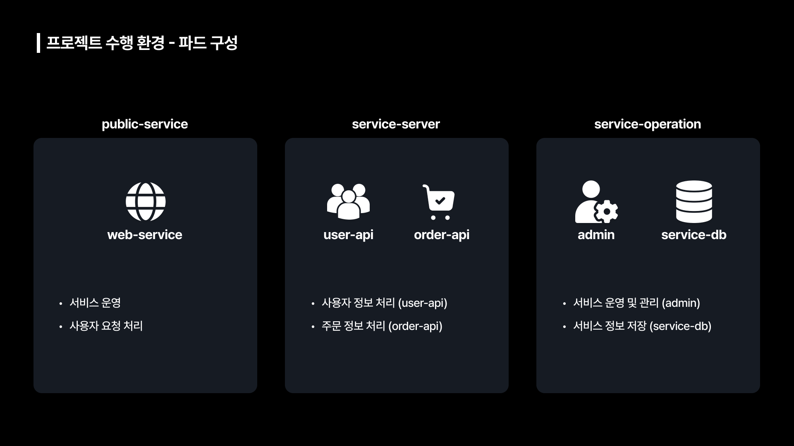
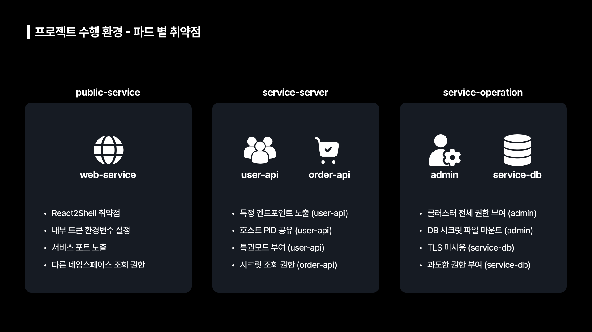
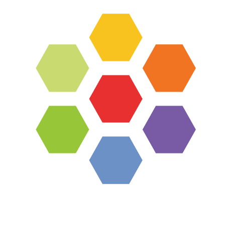
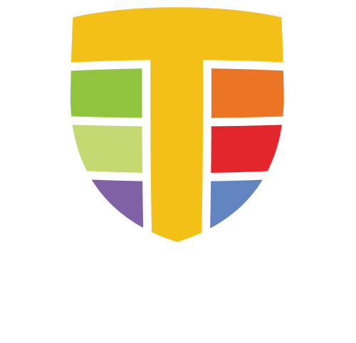
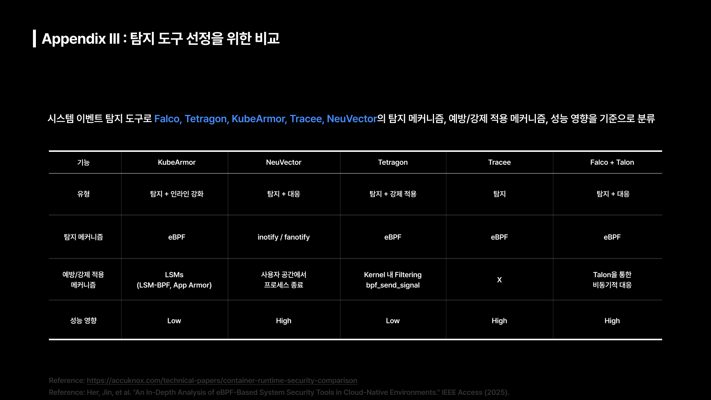
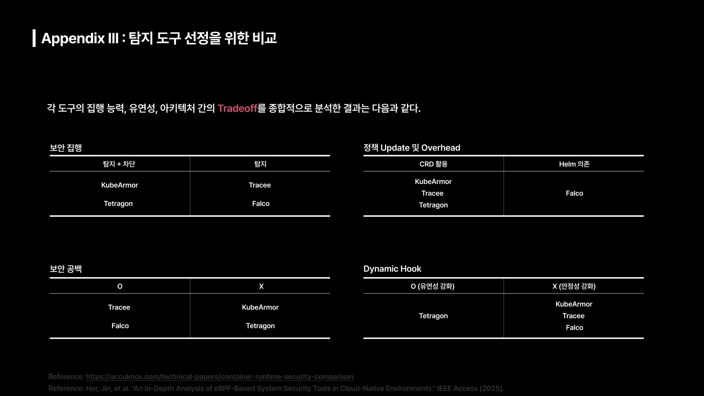

# Project 수행 환경

본 프로젝트의 수행환경 아키텍쳐입니다. 단일 워커노드 쿠버네티스 클러스터를 구축했고, 환경 구성시 Vagrant와 VMware를 이용했습니다. 
해당 프로젝트에서는 **Vault, Istio, Harbor, Trivy**와 같은 보안 권고 사항이 적용되지 않은 기본적인 쿠버네티스 환경을 대상으로 수행했습니다.

## 환경 스펙

|**Role**|**K8s Control Plane**|**K8s Worker Node**|
| :------: | :------: | :------: |
|**CPU**|**2 core**|**4 core**|
|**Memory**|**6GB**|**12GB**|
|**OS**|**Ubuntu 22.04**|**Ubuntu 22.04**|
|**Kernel**|**5.15.0-160-generic**|**5.15.0-160-generic**|

## Worker Node 구성
CNI(Container Network Interface)에 Cilium, 주요 탐지 도구인 Tetragon, Hubble, 통합 로깅 레이어에 fluentd는 Daemon Set 형태로 배포했습니다. 그리고 로그 검색 엔진인 OpenSearch와 분석 및 네트워크 탐지에 Click House는 외부 AWS Ec2로 배포해서 관리했습니다.  

### Fluentd

 

**fluentd**는 오픈 소스 데이터 수집기로 다양한 소스에서 발생하는 로그를 수집해 원하는 목적지로 전달하는 **통합 로깅 레이어**입니다. 
모든 데이터를 **JSON** 형식으로 구조화하여 처리하므로, 서로 다른 형식의 로그(Tetragon, Hubble 등)를 일관된 형태로 통합 관리가 가능합니다. 
**메모리 및 파일** 기반의 Buffer과 **재시도 메커니즘**을 내장하여, 데이터 유실 없이 안정적으로 OpenSearch 등의 백엔드로 전달이 가능합니다. 

### 왜 fluentd를 선택했는가?
1. 공식 문서에서의 언급 
> **Reference**  
> https://kubernetes.io/docs/concepts/cluster-administration/logging/ 

쿠버네티스 공식문서 내 Logging Architecture 섹션에서 노드 레벨 로깅 에이전트로 Fluentd를 예시로 설명하고 있습니다. 공식 문서에서 로깅 레이어에 대한 대표 예시로 등장한만큼 공신력을 확보한 도구라고 생각했습니다.  

2. CNCF (Cloud Native Computing Foundation) 졸업 프로젝트 
> **Reference**  
> https://www.cncf.io/projects/fluentd/ 

CNCF는 리눅스 재단 산하의 오픈소스 기술 재단으로 쿠버네티스와 같은 클라우드 네이티브 기술에 대한 표준을 제시하는 역할을 합니다. 
fluentd는 해당 재단에서 졸업한 프로젝트이고, 이는 기능성과 안정성이 보장된다는 것을 의미합니다.  

3. fluentd vs logstash

|**비교항목**|**fluentd**|**logstash**|
| :------: | :------: | :------: |
|**기반 언어**|**C, Ruby**|**JRuby / Java(JVM)**|
|**메모리 사용량**|**40 ~ 100MB**|**500MB ~ 1GB**|
|**데이터 안정성**|**기본 내장 파일/메모리 버퍼**|**영구 큐 설정 필요**|
|**확장성**|**태그 기반 라우팅**|**조건문 기반 파이프라인**|

> **Reference**  
> https://www.atatus.com/blog/fluentd-vs-logstash/ 
> https://edgedelta.com/company/blog/fluentd-vs-logstash 
> https://logz.io/blog/fluentd-logstash/ 

여러 레퍼런스에서 확인할 수 있듯이 쿠버네티스 환경과 같이 컨테이너 단위의 관리가 필요한 환경에서는 fluentd가 logstash보다 더 안정적으로 동작한다는 것을 알 수 있습니다.

### OpenSearch

 

> **Reference**  
> https://aiven.io/docs/products/opensearch/concepts/opensearch-vs-elasticsearch
> https://github.com/sysnet4admin/_Book_k8sInfra/tree/main/docs/k8s-stnd-arch/2026

**OpenSearch**는 분산형 오픈 소스 검색 및 분석 엔진으로 대규모 로그 데이터를 실시간으로 저장, 검색 및 모니터링이 가능한 플랫폼입니다. 분산 클러스터 아키텍처를 지원하여 노드의 역할을 분리 운영함으로서 데이터 처리 안정성과 확장성을 확보할 수 있습니다.  
대량의 인덱싱 및 쿼리처리에 최적화 되어 있어, 이상 징후 탐지 및 알림 기능을 통해 **SIEM(Security Information and Event Management)** 기반 마련했고, **Apache 2.0 라이선스**를 채택하여 특정 기업의 라이선스 정책 변경, 비용 부담으로부터 자유롭습니다. 
또한, **OpenSearch**는 **Elasticsearch**를 folk하여 만든 오픈소스 검색 엔진인데, 이 과정에서 불필요한 기능을 제거했기 때문에 가볍다라는 장점이 있습니다. 
이러한 이유들로 **OpenSearch**를 로그 통합 검색 엔진으로 채택했습니다.

### ClickHouse

 

> **Reference**  
> https://clickhouse.com/docs/intro 
> https://clickhouse.com/docs/concepts/why-clickhouse-is-so-fast 
> https://clickhouse.com/docs/data-compression/compression-in-clickhouse
> https://clickhouse.com/docs/sql-reference 
> https://clickhouse.com/blog/kubenetmon-open-sourced 
> https://toss.im/slash-24/sessions/29?srsltid=AfmBOooj6Bj3Ovf-EF0Tea2ZT1ar6ro3P8LMTc_sQdWF4y57zYcfFp-f 

ClickHouse는 고성능 **컬럼 지향(Column-oriented) DBMS**로, 방대한 로그 데이터를 실시간으로 집계 및 분석할 수 있는 **온라인 분석 처리(OLAP) 엔진**입니다. 필요한 컬럼만 읽어 들이는 구조와 벡터 실행 기술로 초당 수억 개 레코드를 스캔하는 **고속 쿼리 성능**을 보장하고, 유사한 데이터가 모이는 컬럼별 압축을 통해 **스토리지 효율성**을 제공합니다. 
**표준 SQL을 지원**하기 때문에 Tetragon, Hubble로 수집된 보안 이벤트들 간 **상관관계 분석 및 패턴 탐색**을 수행할 수 있습니다.

### Pod 구성
본 프로젝트에서는 **public-service, service-server, service-operation**의 3단 네임스페이스(namespace) 분리를 통해 “공격 전개 단계”와 “운영 역할”을 논리적으로 구획화했습니다. 각 네임스페이스 별 구성 Pod에 주입된 기능과 주요 취약점은 아래 사진을 참고 해주세요. 

## 주요 탐지 도구 소개
### Cilium

 

Cilium은 **eBPF** 기반으로 설계 된 **CNI(Container Network Interface)** 플러그인으로 네트워크, 보안 및 관측성을 통합 제공합니다. IP 주소가 아닌 Identity (레이블 / ID) 기반으로 L3 ~ L7까지 보안 정책을 적용할 수 있습니다.

### Tetragon

 

Tetragon은 **eBPF** 기반 **커널 런타임 보안 관측 도구**로 K8s 환경에서 발생하는 시스템, 네트워크 이벤트를 커널 레벨에서 실시간으로 수집 및 분석을 가능하게 합니다.  
**Kprobe, Uprobe, LSM** 등 다양한 Hook Point를 동적으로 활용하여 시스템 내부에서 발생하는 다양한 이벤트를 정밀하게 추적이 가능하고 프로세스의 부모 자식 관계를 지속적으로 추적하여 하나의 행위 흐름으로 연결하여 커널 레벨에서 **Observability** 확보가 가능합니다. 
또한 Tetragon은 **Kernel Filter** 방식을 사용하기 때문에 **User Level에서 부하를 최소화** 할 수 있고, **CRD(Custom Resource Definition)** 를 지원하기 때문에 정책 업데이트 시 **다운타임 없이 정책을 적용**할 수 있습니다.

### Hubble

 

Hubble은 Cilium CNI 위에서 동작하는 **eBPF 기반 네트워크 가시성 관측 도구**로, K8s 클러스터 내에서 발생하는 서비스 간 통신 흐름을 커널 레벨에서 실시간으로 수집 및 분석이 가능합니다. 패킷 미러링, Proxy에 의존하지 않고 네트워크 이벤트를 직접 관측함으로써 기존 네트워크 모니터링 방식 대비 **낮은 오버헤드**를 갖는 것이 특징입니다.  
그리고 **K8s 메타데이터를 네트워크 흐름과 결합**하여 제공함으로써 K8s 환경에 최적화된 네트워크 가시성 확보 가능하지만 **Cilium에 종속**적이기 때문에 Cilium 없이 독립적으로 사용은 불가능합니다.

## 탐지 도구 선정 과정

 

 

> **Reference**  
> https://accuknox.com/technical-papers/container-runtime-security-comparison  
> Her, Jin, et al. "An In-Depth Analysis of eBPF-Based System Security Tools in Cloud-Native Environments." IEEE Access (2025).

본 프로젝트의 목표는 단순 위협 탐지가 아니기 때문에 경보 중심의 Falco, Low Level 분석에 특화된 Tracee보다 Process 동작을 K8s 환경에서 구조적으로 관측 가능한 Tetragon이 적합하다고 판단했습니다. 또한, 네트워크 흐름을 K8s 메타데이터와 결합하여 추적 가능한 Hubble의 조합이 공격 행위 분석에 가장 적합하다고 판단했습니다.