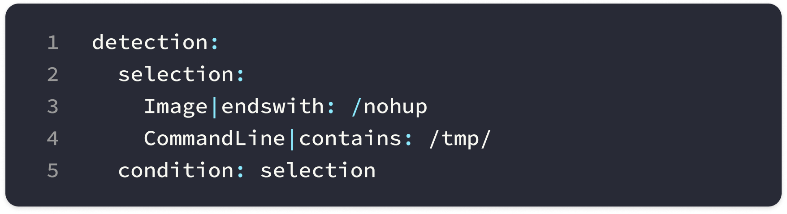
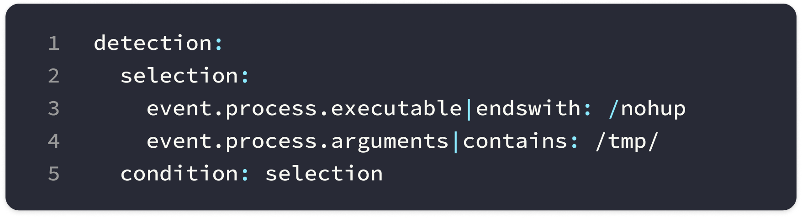
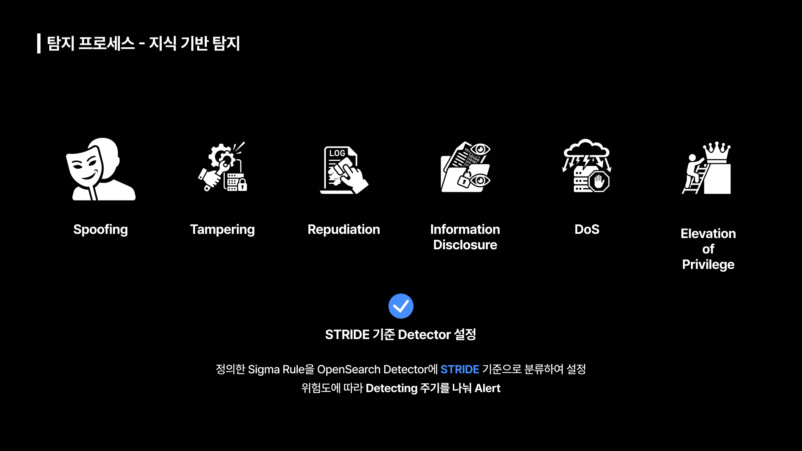
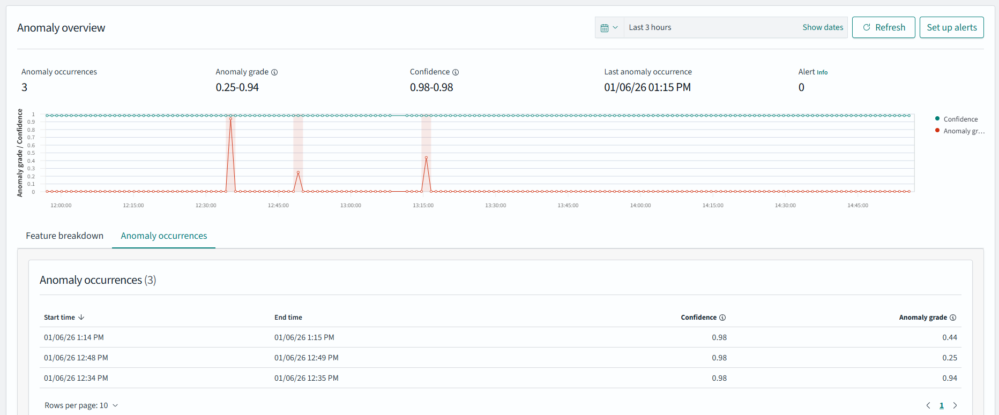
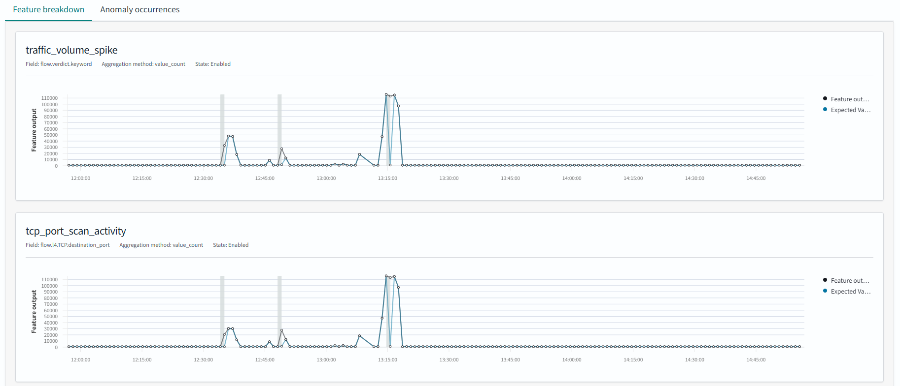
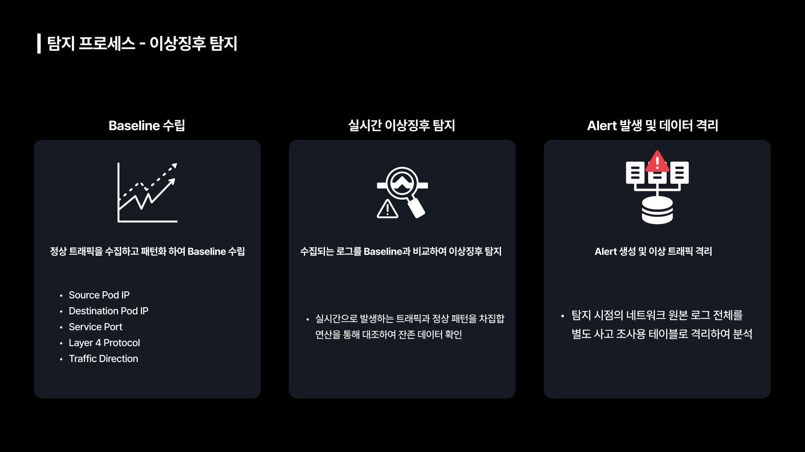

# 다중 탐지 프레임워크 (Multi-Detection Framework)

앞서 언급한 단일 탐지 방식의 한계를 극복하기 위해 본 프로젝트에서는 **다중 탐지 프레임워크**를 설계 했습니다. 다중 탐지 프레임워크는 **Tetragon**을 활용한 행위 기반 탐지, **Sigma Rule**을 활용한 지식 기반 탐지, **ClickHouse**에서 이상탐지로 구성되어 있습니다. 
설계한 탐지 프로세스의 요소는 각각 독립적으로 동작하지만 수집된 이벤트들은 분석 과정에서 상호 보완적으로 활용하여 탐지와 분석의 신뢰성을 확보할 수 있었습니다.

## 행위 기반 탐지 (Behavior Based Detection)
본 프로젝트에서는 Tetragon의 Tracing Policy 설계를 통해 행위 기반 탐지를 고도화 했습니다.

### Tetragon 로그 포맷

Tetragon은 정책에 부합하는 프로세스 이벤트가 발생하면 분석 및 시각화가 용이하도록 JSON 형식으로 로그를 생성합니다. 위 사진은 Tetragon이 생성한 로그로 왼쪽부터 차례대로 프로세스 실행의 시작을 뜻하는 process_exec, 정책에 탐지 된 순간인 process_kprobe, 프로세스 종료를 뜻하는 process_exit 로그를 확인할 수 있습니다.  

### Tetragon 정책 설계

초기 Tetragon 정책 설계시 MITRE ATT&CK 컨테이너 환경 위협 매트릭스를 활용하여 공격을 수행하면서 Artifact를 분석하여 Technique 별로 개별적으로 정책을 설계했습니다. 이 과정에서 발생한 문제는 다음과 같습니다. 

**1. 탐지 영역 중복으로 인한 성능 저하**  
MITRE ATT&CK 매트릭스의 Technique 별로 정책을 설정할 경우 서로 다른 정책에서 동일한 함수와 프로세스를 관측하여 탐지 영역이 중복되는 경우가 있습니다.  
동일한 지점을 중복하여 관측할 경우 시스템 전반의 성능 저하로 이어질 가능성이 매우 높습니다.  

**2. 정책 개수 증가로 인한 성능 저하**  
앞서 언급한 방식으로 정책을 설계한 결과 초기 정책 개수는 약 40개였습니다. 추후 정책 업데이트 과정에서 관리적 차원에서의 복잡도 증가라는 문제를 겪었습니다.  
또한 Tetragon의 각 정책은 커널 내 상태 저장을 위해 eBPF Map을 생성하고, 커널의 Hook Point에 eBPF 프로그램을 부착하게 되는데 이 과정에서 메모리 사용량이 증가하고 eBPF 프로그램의 체인이 길어질 수 있습니다.  

**3. 정책 인자 값 파싱의 어려움**  
Tetragon 정책은 System Call, Kernel 함수의 인자값을 파싱하는 방식으로 동작합니다. 이러한 특성은 특정 인자 값에 따라 행위를 구분해야 하는 경우 커널 내 포인터 구조의 복잡성으로 인해 Tetragon이 실제 값을 정확하게 읽어내지 못하는 문제가 있습니다.  

앞서 언급한 문제를 해결하기 위해 설계한 정책에 대한 통합 검증 및 최적화 과정을 거쳤습니다. 이를 통해 File 접근, Network 행위, 권한 업데이트, 특정 커널 프로세스 실행 네 가지로 구분하여 정책을 재설계하여 관리적 차원의 효율성과 시스템 전반의 성능적인 안정성을 확보했습니다.  

위 사진은 본 프로젝트에서 설계한 민감 파일 접근에 대한 Tetragon 탐지 정책의 예시입니다. 해당 정책은 LSM(Linux Security Module) Hook의 함수인 `security_file_open`을 활용하여 공격자가 `cat` 명렁을 통해 `/etc/passwd` 파일에 접근하려는 행위를 탐지합니다.  
파일이 열리는 과정을 살펴보면 파일을 읽으라는 명령이 들어오면 System Call을 통해 Kernel Level에 VFS(Virtual File System)로 들어오고, 요청한 파일을 해당 파일 시스템에서 찾아서 해당 파일 내용이 반환됩니다.  
파일에 접근할 때 사용되는 System Call 함수는 `sys_open`, `sys_openat` 등 여러 가지가 존재합니다. 만약 정책에서 `sys_open`을 활용하여 탐지하고 있을 경우 공격자가 `sys_openat`과 같이 다른 System Call 함수를 통해 파일을 읽으려는 시도를 탐지하지 못하게 됩니다. 따라서 해당 정책에서는 System Call보다 더 깊숙한 Kernel Level 내 파일 시스템에서 민감 파일에 대한 읽기 요청이 들어오면 탐지하도록 하여 앞서 언급한 미탐 문제를 해결하고자 했습니다.  
또한, 중요 파일 업데이트(ex. `vfs_write`) 이벤트 발생시 어떤 내용이 추가 또는 삭제됐는지 관측할 수 있도록 하여 전반적인 시스템에 대한 신뢰성을 확보하고자 했습니다.  
 

## 지식 기반 탐지 (Knowledge Based Detection)
본 프로젝트에서 지식 기반 탐지는 SIEM(Security Information and Event Management)의 표준인 Sigma Rule을 통해 고도화 했습니다.

### Sigma Rule 도입 배경

행위 기반 탐지는 APT, Zero Day 취약점과 같이 알려지지 않은 공격들에 대한 대응이 가능하다는 장점이 있지만 정상적인 관리자의 행위와 공격자의 행위를 구분하는 과정에서 많은 노이즈가 발생한다는 단점이 존재합니다. 노이즈를 줄이기 위해서 필터링을 타이트하게 걸면 미탐이 증가하여 행위 기반 탐지만으론 한계가 존재합니다.  
따라서 본 프로젝트에서는 이를 지식 기반 탐지가 가지고 있는 높은 정확성, 빠른 탐지 속도라는 장점을 통해 앞서 설명한 한계를 해결하고자 했습니다. 또한 SIEM의 표준인 Sigma Rule을 활용함으로써 지식 기반 탐지의 신뢰성도 확보하고자 했습니다.

### Open Search Security Analytics 기능 활용

본 프로젝트에서 Open Search를 활용하고 있기 때문에 Open Search에서 제공하는 SIEM 솔루션인 **Security Analytics** 를 통해 Sigma Rule을 도입하고자 했습니다.  
K8s 클러스터 Runtime 환경에서 Tetragon의 Tracing Policy를 통해 행위 기반 탐지 결과가 fluentd를 통해 Open Search로 전송되면, Security Analytics를 통해 설정한 Sigma Rule Detector가 이를 검사하고 공격 행위가 있다라고 판별될 시 Alert를 발생시킵니다.  
하지만 Sigma Rule 도입 과정에서 아래와 같은 문제가 발생했습니다.  

**1. 로그 스키마 불일치**  
Sigma Rule은 ECS(Elastic Common Schema) 포맷에 맞춰 설계되어 있습니다. Tetragon과 Hubble이 생성하는 로그는 ECS 포맷이 아니기 때문에 그대로 사용이 불가능 했습니다.

**2. K8s 환경의 특수성**  
Sigma Rule을 그대로 적용했을 때 정상적인 내부 통신 및 시스템 관리 프로세스가 공격 행위로 오탐될 가능성이 존재했습니다.

위와 같은 문제를 해결하기 위해 본 프로젝트에서는 Open Search에서 **로그를 정규화** 하고 **Log Type을 정의** 한 뒤 **Sigma Rule 필드를 Mapping** 시켜 로그 스키마 불일치 문제를 해결하고, **Tetragon Log의 계층 구조 분석** 을 통해 K8s 워크로드의 정상 범주를 반영한 필터링 로직을 추가함으로써 탐지 성능을 확보 했습니다.

다음은 /tmp/ 디렉토리 내의 파일을 nohup으로 실행해 세션 종료 후에도 프로세스를 지속시키려는 행위를 탐지하는 `Suspicious Nohup Execution` 시그마 룰 예시입니다.  

Sigma Rule의 Condition 부분을 보면 `Image` 필드와 `CommandLine` 필드를 통해 필터링하는 것을 알 수 있습니다. `Image` 필드는 실제로 실행된 바이너리의 절대 경로를 의미하고, `CommandLine` 필드는 실행 파일 뒤에 붙는 옵션과 인자값들의 집합을 의미합니다.

따라서 우리는 Tetragon 로그에서 Sigma Rule과 의미적으로 동일한 필드인 `event.process.executable`과 `event.process.arguments` 필드를 매핑시켜 Sigma Rule을 적용했습니다.  

이러한 과정을 거쳐 약 180개 Sigma Rule을 적용하려고 했지만 단일 Detector에 생성한 Sigma Rule을 적용했을 때 연산량 증가로 인해 Open Search 엔진이 지속적으로 다운되는 문제가 발생했습니다. 따라서 STRIDE 기준으로 Detector를 설정하고 위험도에 따라 Detecting 주기를 나눠 Alert를 발생시킴으로써 이 문제를 해결했습니다.  

예를 들어 STRIDE 중 `Elevation of Privilege` 경우 현재 권한에서 높은 권한을 취득해 전체 시스템에 치명적일 수 있으므로 주기를 1분으로 설정하여 지속적으로 감시하고자 했고, `Repudiation`의 경우 흔적 삭제를 통한 부인에 해당하는데 이는 권한 상승에 비해 치명성이 낮고, Tetragon을 통해 어떤 파일 또는 프로그램에서 어떤 내용이 삭제됐는지 탐지할 수 있기 때문에 주기를 5분으로 설정하여 Detecting 과정에서의 부하를 최소화 하고자 했습니다.

## 이상 징후 탐지 (Baseline Based Anomaly Detection)
본 프로젝트에서 이상 징후 탐지는 Baseline 수립을 통해 진행했습니다. Anomaly Detection은 Hubble이 수집한 네트워크 이벤트 로그를 기반으로 동작합니다. 초기 Open Search에서 제공하는 Anomaly Detector 기능을 통해 이상 징후 탐지를 진행하려고 했습니다. 하지만 이 과정에서 몇 가지 문제점들을 발견하여 최종적으로 ClickHouse를 통해 Anomaly Detection을 구현했습니다.  

**1. Anomaly Detector Baseline 수립 과정에서 문제**  

Open Search에서 제공하는 Anomaly Detector는 RCF(Random Cut Forest) 알고리즘을 사용하여 Open Search 데이터의 이상징후를 거의 실시간으로 자동 감지합니다.
이 알고리즘은 비지도 학습 알고리즘으로 입력 스트림의 개략적인 형태를 모델링하여 각 데이터 포인트에 대한 이상 등급과 신뢰도 점수를 계산하는데, 이때 fluentd와 Open Search의 데이터 처리 속도 차이로 정상 트래픽이 한번에 몰리면 공격으로 인지하여 Alert를 발생시킨다는 점과 공격 트래픽을 정상 범주로 연산하는 것과 같은 오탐 문제가 발생했었습니다. 이러한 문제로 정상 행위와 비정상 행위를 구분하는 기준인 Baseline 수립에 어려움을 겪었습니다.
 

**2. Open Search 과부하**  
Open Search에 지식 기반 탐지, 데이터 인덱싱, 로그 검색 엔진 등 이미 많은 역할이 부여되어 있었습니다. 이러한 점은 성능 저하로 인한 시스템 장애로 까지 이어져 정상적인 프로젝트 수행이 불가능 했습니다. 이를 해결하기 위해 노드 분리를 통해 부하 분산을 시도했지만 성능 저하라는 문제는 근본적으로 해결할 수 없었습니다.  
이 상태에서 네트워크 로그까지 처리하는 것은 불가능 하다고 판단했고, 탐지 및 분석 환경에 안정성을 확보할 수 없다고 생각했습니다.  

이러한 문제를 해결하기 위해 방안을 모색하던 중 ClickHouse라는 컬럼지향 DataBase를 알게 되었고, 대용량 로그 처리에 대한 안정성을 갖고 있기 때문에 이를 이상징후 탐지의 엔진으로 활용하기 적합하다고 생각했습니다.
> ClickHouse가 어떤 도구인지에 대한 설명은 Infra 폴더의 README를 참고 해주세요.

본 프로젝트에서 ClickHouse 도입에 대한 당위성을 확보하기 위해 Open Search와 ClickHouse 두 도구를 대상으로 저장 공간, 리소스 사용량, 쿼리 응답 시간 세 가지 요소에 대해 BMT(Bench Marking Test)를 진행했습니다.

**1. 저장공간**  

|**구분**|**문서 / 행 수**|**디스크 점유량**|**레코드 평균 크기**|
| :------: | :------: | :------: | :------: |
|**Open Search**|**848,203건**|**929.3MB**|**~ 1.09KB**|
|**ClickHouse**|**857,436건**|**49.00MB**|**~0.06KB**|

먼저 저장공간에 대한 비교 결과를 보면 디스크 점유량과 레코드 평균 크기가 모두 **ClickHouse**가 **Open Search**보다 약 18.9배 효율적이라는 것을 확인할 수 있습니다

 

**2. 리소스 사용량**  

|**구분**|**CPU 사용률**|**메모리 사용량**|
| :------: | :------: | :------: |
|**Open Search**|**~1.5%**|**66.47 GiB**|
|**ClickHouse**|**~13.5%**|**1.32GiB**|

리소스 사용량 측면에서 ClickHouse가 Open Search보다 CPU 사용률 측면에서 약 9배 높지만 메모리 사용량은 약 66배 효율적이라는 것을 확인할 수 있습니다. 이는 ClickHouse는 동적 할당 방식을 사용하고 Open Search는 힙 메모리 고정 방식을 사용하기 때문입니다.

**3. 쿼리 응답 시간**  

|**구분**|**쿼리 응답 시간**|**성능 격차**|
| :------: | :------: | :------: |
|**Open Search**|**1.968 sec**|**기준 (1.0x)**|
|**ClickHouse**|**0.389 sec**|**약 5.06배 향상**|

쿼리 응답 시간 측면에서 ClickHouse가 Open Search보다 약 5.06배 빠르다는 것을 확인할 수 있습니다.

위 실험을 통해 Open Search에서 네트워크 로그 관리와 Anomaly Detection 역할을 Click House로 이전함으로써 전체적인 시스템 안정성과 탐지 기능의 안정성을 모두 확보했습니다.  

ClickHouse에서 Anomaly Detection은 세 가지 단계를 따라 진행됩니다.  

1. Baseline 수립  
이 단계에서는 정상 트래픽을 수집하고 패턴화 하여 이상행위와 정상행위를 구분하는 Baseline을 수립하는 단계입니다. 이 단계에서는 Hubble Log에서 `Src IP/Pod`, `Dst IP/Pod`, `Src/Dst Pod Prefix`, `Port`, `L4 Protocol 정보`, `Traffic 방향성`을 추출하여 Baseline을 수립합니다.

2. 이상징후 탐지  
이 단계에서는 실시간으로 수집되는 로그를 수립한 Baseline과 비교하여 이상징후 탐지를 진행합니다. 실시간으로 발생하는 트래픽과 정상 패턴을 차집합 연산을 통해 대조하여 잔존 데이터를 확인하는 방식으로 진행됩니다.

3. Alert 발생 및 데이터 격리  
이 단계에서는 앞선 단계에서 잔존 데이터가 확인될 시 Alert를 발생시켜 탐지 시점의 네트워크 원본 로그 전체를 별도 사고 조사용 테이블로 격리하여 분석합니다.

