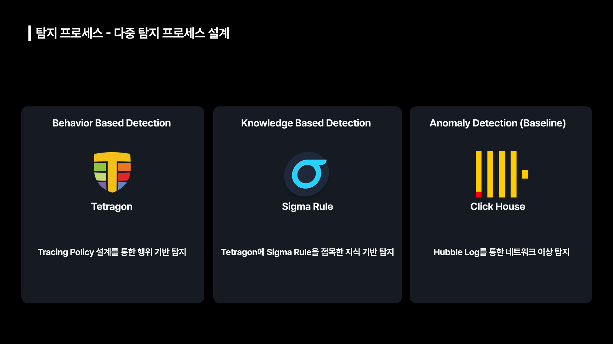
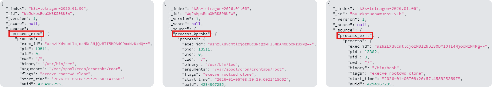
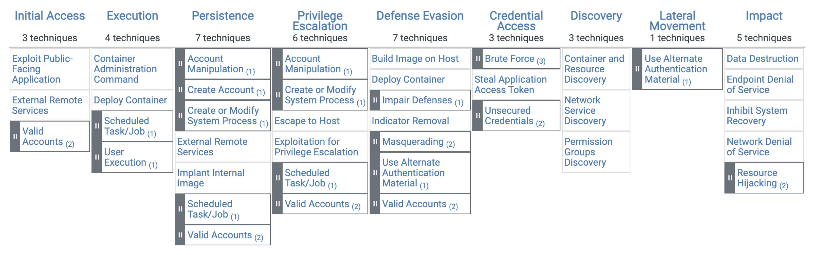
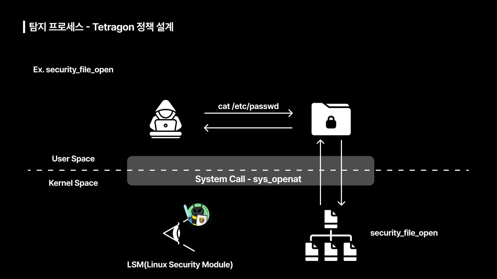

# 다중 탐지 프레임워크 (Multi-Detection Framework)

앞서 언급한 단일 탐지 방식의 한계를 극복하기 위해 본 프로젝트에서는 **다중 탐지 프레임워크**를 설계 했습니다. 다중 탐지 프레임워크는 **Tetragon**을 활용한 행위 기반 탐지, **Sigma Rule**을 활용한 지식 기반 탐지, **ClickHouse**에서 이상탐지로 구성되어 있습니다. 
설계한 탐지 프로세스의 요소는 각각 독립적으로 동작하지만 수집된 이벤트들은 분석 과정에서 상호 보완적으로 활용하여 탐지와 분석의 신뢰성을 확보할 수 있었습니다.

## 행위 기반 탐지
본 프로젝트에서는 Tetragon의 Tracing Policy 설계를 통해 행위 기반 탐지를 고도화 했습니다.

### Tetragon 로그 포맷

Tetragon은 정책에 부합하는 프로세스 이벤트가 발생하면 분석 및 시각화가 용이하도록 JSON 형식으로 로그를 생성합니다. 위 사진은 Tetragon이 생성한 로그로 왼쪽부터 차례대로 프로세스 실행의 시작을 뜻하는 process_exec, 정책에 탐지 된 순간인 process_kprobe, 프로세스 종료를 뜻하는 process_exit 로그를 확인할 수 있습니다.  

### Tetragon 정책 설계

초기 Tetragon 정책 설계시 MITRE ATT&CK 컨테이너 환경 위협 매트릭스를 활용하여 공격을 수행하면서 Artifact를 분석하여 Technique 별로 개별적으로 정책을 설계했습니다. 이 과정에서 발생한 문제는 다음과 같습니다. 

**1. 탐지 영역 중복으로 인한 성능 저하**  
MITRE ATT&CK 매트릭스의 Technique 별로 정책을 설정할 경우 서로 다른 정책에서 동일한 함수와 프로세스를 관측하여 탐지 영역이 중복되는 경우가 있습니다.  
동일한 지점을 중복하여 관측할 경우 시스템 전반의 성능 저하로 이어질 가능성이 매우 높습니다.  

**2. 정책 개수 증가로 인한 성능 저하**  
앞서 언급한 방식으로 정책을 설계한 결과 초기 정책 개수는 약 40개였습니다. 추후 정책 업데이트 과정에서 관리적 차원에서의 복잡도 증가라는 문제를 겪었습니다.  
또한 Tetragon의 각 정책은 커널 내 상태 저장을 위해 eBPF Map을 생성하고, 커널의 Hook Point에 eBPF 프로그램을 부착하게 되는데 이 과정에서 메모리 사용량이 증가하고 eBPF 프로그램의 체인이 길어질 수 있습니다.  

**3. 정책 인자 값 파싱의 어려움**  
Tetragon 정책은 System Call, Kernel 함수의 인자값을 파싱하는 방식으로 동작합니다. 이러한 특성은 특정 인자 값에 따라 행위를 구분해야 하는 경우 커널 내 포인터 구조의 복잡성으로 인해 Tetragon이 실제 값을 정확하게 읽어내지 못하는 문제가 있습니다.  

앞서 언급한 문제를 해결하기 위해 설계한 정책에 대한 통합 검증 및 최적화 과정을 거쳤습니다. 이를 통해 File 접근, Network 행위, 권한 업데이트, 특정 커널 프로세스 실행 네 가지로 구분하여 정책을 재설계하여 관리적 차원의 효율성과 시스템 전반의 성능적인 안정성을 확보했습니다.  

위 사진은 본 프로젝트에서 설계한 민감 파일 접근에 대한 Tetragon 탐지 정책의 예시입니다. 해당 정책은 LSM(Linux Security Module) Hook의 함수인 `security_file_open`을 활용하여 공격자가 `cat` 명렁을 통해 `/etc/passwd` 파일에 접근하려는 행위를 탐지합니다.  
파일이 열리는 과정을 살펴보면 파일을 읽으라는 명령이 들어오면 System Call을 통해 Kernel Level에 VFS(Virtual File System)로 들어오고, 요청한 파일을 해당 파일 시스템에서 찾아서 해당 파일 내용이 반환됩니다.  
파일에 접근할 때 사용되는 System Call 함수는 `sys_open`, `sys_openat` 등 여러 가지가 존재합니다. 만약 정책에서 `sys_open`을 활용하여 탐지하고 있을 경우 공격자가 `sys_openat`과 같이 다른 System Call 함수를 통해 파일을 읽으려는 시도를 탐지하지 못하게 됩니다. 따라서 해당 정책에서는 System Call보다 더 깊숙한 Kernel Level 내 파일 시스템에서 민감 파일에 대한 읽기 요청이 들어오면 탐지하도록 하여 앞서 언급한 미탐 문제를 해결하고자 했습니다.  
또한, 중요 파일 업데이트(ex. `vfs_write`) 이벤트 발생시 어떤 내용이 추가 또는 삭제됐는지 관측할 수 있도록 하여 전반적인 시스템에 대한 신뢰성을 확보하고자 했습니다.