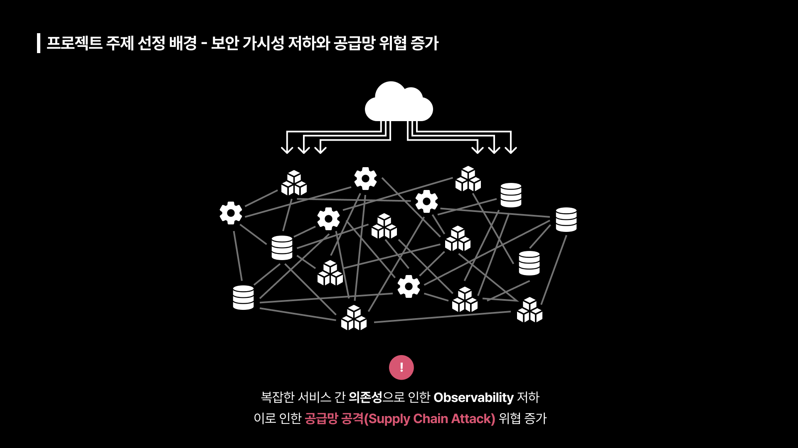
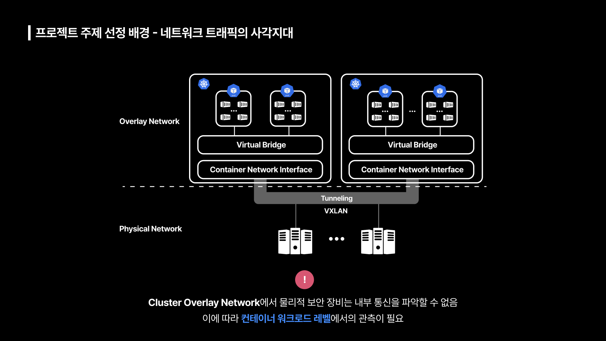
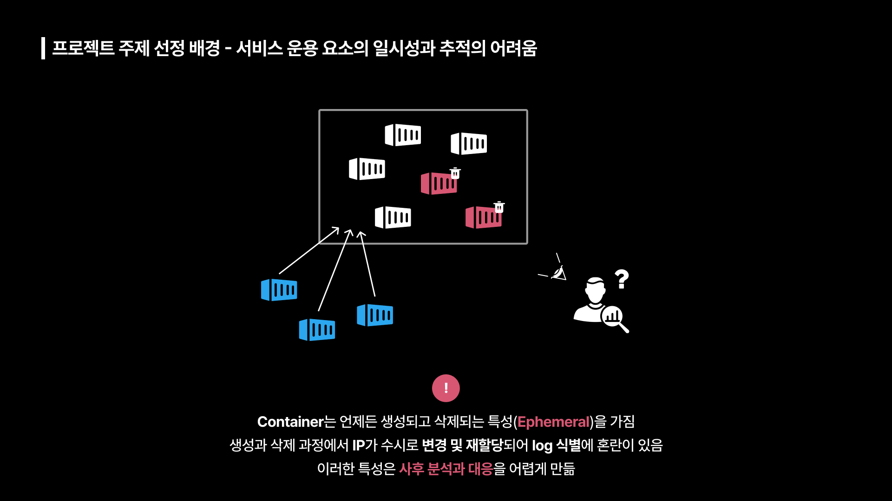
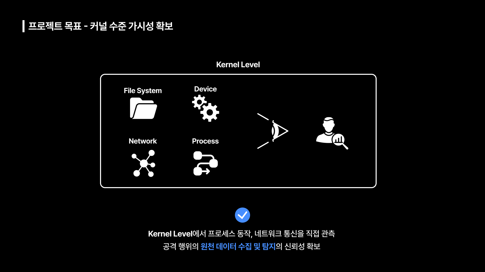
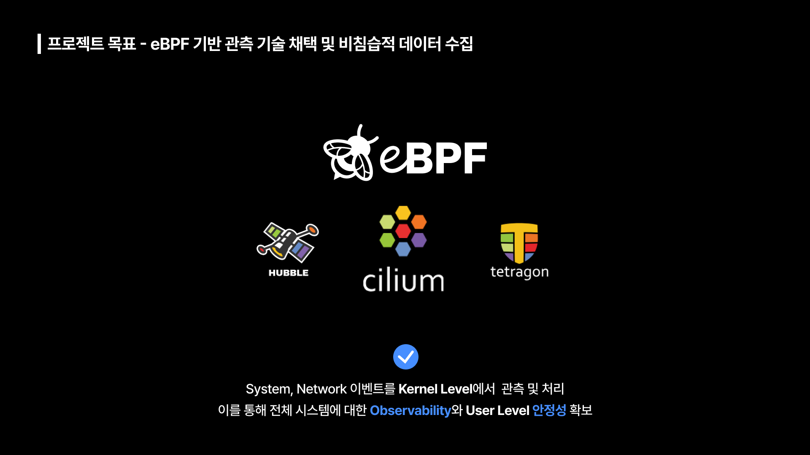
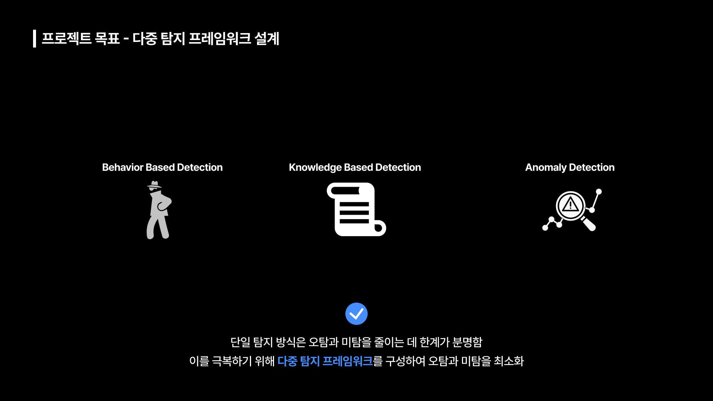
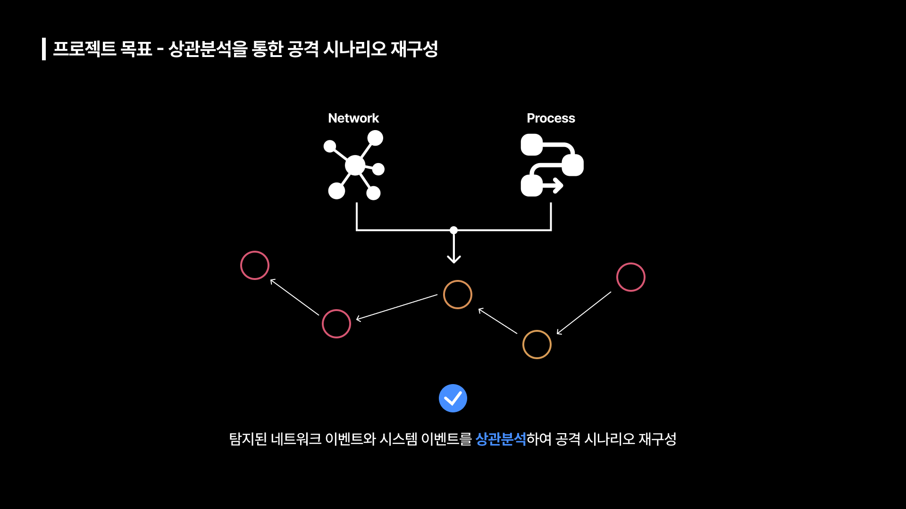
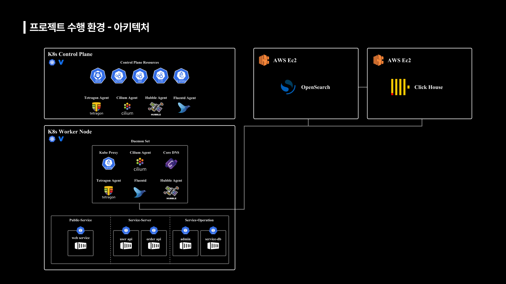

# KERNEL: K8s Evidence Reconstruction &amp; Network Event Ledger

> 본 프로젝트는 토스뱅크 사이버보안 엔지니어 부트캠프에서 진행되었습니다.

## 프로젝트 Overview
KERNEL 프로젝트는 쿠버네티스 환경에서 위협 행위에 대한 **탐지 및 분석 고도화**라는 주제로 진행한 팀 프로젝트입니다.  

### 문제 인식
1. **서비스 아키텍처의 변화** 

서비스 기능적 요구사항이 증가함에 따라 MSA 구조로의 전환이 이루어졌습니다. MSA 구조에서 컨테이너 환경은 필수적이고, Kubernetes는 컨테이너 관리의 표준이 되었습니다. 
이러한 구조적 변화로 인해 서비스 간 의존성이 증가하여 전체 시스템에 대한 Observability가 저하 되었습니다. 이로 인해 공급망 공격(Supply Chain Attack) 위협이 증가하고 있는 추세입니다.  

2. **네트워크 트래픽의 사각지대** 

컨테이너 환경에서 서비스 간 통신은 Cluster Overlay Network에서 Tunneling 된 상태로 이루어집니다. 따라서 기존 보안장비의 Inline 레벨에서 탐지는 불가능하여 Container Workload 레벨에서의 심층적인 관측이 필요합니다.  

3. **서비스 운용 요소의 일시성과 추적의 어려움** 

컨테이너는 생성과 삭제 과정에서 IP, 컨테이너 메타데이터 같은 정보들이 수시로 변경 및 재할당 되는 일시성(Ephemeral)을 가지고 있습니다. 이러한 특성은 로그 식별에 혼란을 야기하고 사후 분석과 대응을 어렵게 만듭니다.  

### 프로젝트 목표
1. **Kernel Level에서의 가시성 확보** 

User Level에서 동작하는 기존 보안 도구들은 공격자의 타겟이 될 수 있어 변조에 취약합니다. 따라서 본 프로젝트에서는 Kernel Level에서 프로세스, 네트워크 이벤트를 직접 관측하여 공격 행위의 원천 데이터 수집 및 탐지의 신뢰성을 확보하고자 했습니다.  

2. **eBPF 기반 관측 기술 채택 및 비침습적 데이터 수집** 

Kernel Level에서 동작하는 보안 도구는 탐지된 데이터 처리를 User Level에서 진행하기 때문에 이 과정에서 과도하게 **Context Switching**이 일어납니다. 이는 시스템 리소스 사용량 증가로 이어져 서비스 운영에 치명적일 수 있습니다. 따라서 본 프로젝트는 탐지와 탐지된 이벤트를 Kernel Level에서 처리하는 **eBPF** 기반 도구를 선정하여 전체 시스템에 대한 **Observability**와 User Level에서 안정성을 확보하고자 했습니다.  

3. **다중 탐지 프레임워크 설계** 

각각의 단일 탐지 방식에서 오탐과 미탐을 줄이는 데 한계가 분명하기 때문에 행위 기반, 지식 기반, 이상 탐지로 이루어진 **다중 탐지 프레임워크**를 설계하여 오탐과 미탐을 최소화하고자 했습니다.  

4. **상관분석을 통한 공격 시나리오 재구성** 

탐지된 시스템, 네트워크 이벤트를 **상관분석**하여 최종적으로 공격 흐름을 재구성하는 것을 목표로 했습니다.  

### 프로젝트 수행환경 아키텍쳐

## 팀 소개

<h3>Team ForenSeek</h3>

| **조성열** | **한희수** | **엄민송** | **황주하** | **이주현** | **허창렬** |
| :------: | :------: | :------: | :------: | :------: | :------: |
| [   @sychoii](https://github.com/Choseongyul) | [   @crowndaisy](https://github.com/crowndaisy76) | [   @skymin1121](https://github.com/skymin1121) | [   @jjjjjuha](https://github.com/jjjjjuha) | [   @ImitationProgramer](https://github.com/ImitationProgramer) | [   @CHANGRYEOL HEO](https://github.com/loopbackIP) |
| **팀장** | **팀원** | **팀원** | **팀원** | **팀원** | **팀원** |
| **공격 시나리오 설계 Tetragon 정책 설계 탐지 프로세스 고도화** | **Click House 분석 파이프라인 설계 탐지 및 분석 프로세스 고도화** | **다중 탐지 프레임워크 설계 탐지 및 분석 프로세스 고도화** | **인프라 설계 Sigma Rule 최적화** | **인프라 설계 Sigma Rule 최적화** | **공격 시나리오 설계 Sigma Rule 최적화** |

## 프로젝트 기술 스택

 
 
  

  
   

 
 

## 프로젝트 시연 영상
> 💡 각 사진을 클릭하면 유튜브를 통해 시연 영상 확인이 가능합니다.
- 탐지 프로세스

- 분석 프로세스

