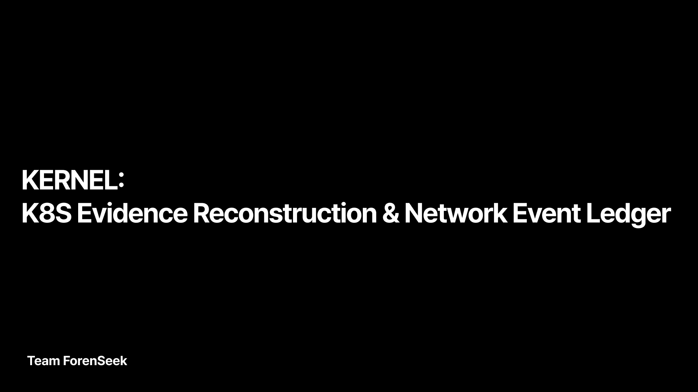

# KERNEL: K8s Evidence Reconstruction &amp; Network Event Ledger

> 본 프로젝트는 토스뱅크 사이버보안 엔지니어 부트캠프에서 진행되었습니다.

## 프로젝트 Intro
KERNEL 프로젝트는 쿠버네티스 환경에서 위협 행위에 대한 **탐지 및 분석 고도화**라는 주제로 진행한 팀 프로젝트입니다.  **eBPF** 기반 **CNI**인 **Cilium**과 시스템 및 네트워크 탐지 도구인 **Tetragon**과 **Hubble**을 활용함으로서 User Level에서의 부하를 최소화하고 **다중 탐지 프레임워크** 설계를 통해 탐지 Hole을 최소화하는 것을 목표로 했습니다. 
또한 탐지된 시스템, 네트워크 이벤트를 **상관분석**하여 공격 시나리오를 재구성하는 것을 목표로 했습니다.

## 팀 소개

<h3>Team ForenSeek</h3>

| **조성열** | **한희수** | **엄민송** | **황주하** | **이주현** | **허창렬** |
| :------: | :------: | :------: | :------: | :------: | :------: |
| [   @sychoii](https://github.com/Choseongyul) | [   @crowndaisy](https://github.com/crowndaisy76) | [   @skymin1121](https://github.com/skymin1121) | [   @jjjjjuha](https://github.com/jjjjjuha) | [   @ImitationProgramer](https://github.com/ImitationProgramer) | [   @CHANGRYEOL HEO](https://github.com/loopbackIP) |
| **팀장** | **팀원** | **팀원** | **팀원** | **팀원** | **팀원** |
| **공격 시나리오 설계 Tetragon 정책 설계 탐지 프로세스 고도화** | **Click House 분석 파이프라인 설계 탐지 및 분석 프로세스 고도화** | **다중 탐지 프레임워크 설계 탐지 및 분석 프로세스 고도화** | **인프라 설계 Sigma Rule 최적화** | **인프라 설계 Sigma Rule 최적화** | **공격 시나리오 설계 Sigma Rule 최적화** |

## 프로젝트 기술 스택

 
 
  

  
   

 
 

